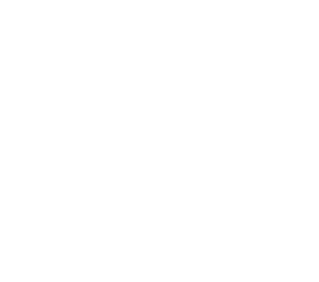

# Clamp: A Microservices Orchestrator

> An opinionated approach to microservices architecture and orchestration

## Introduction
Clamp lets you stitch together services in your distributed platform. Built primarily as a microservices orchestrator, it serves to cut down on boilerplate and decomposes complexities related to inter-service communication. Define workflows that seamlessly route to your services over both synchronous and asynchronous communication calls.

### Battle-tested design

 - Approach used on multiple platforms in production.
 - Seamless orchestration at scale
 - Facilitates workflow management
 - Central tracking of flows

### Batteries included
**Lightweight JSON-based workflow management**
Define and update workflows even at run-time, using our APIs.

**Simple payload transformation between steps** Use context variables such as past request and response content to create service payloads. Currently only support JSON payloads.

**Branching and conditional logic in workflows** Simplicity keeps business logic out and provides required flexibility to introduce multiple execution paths for scenarios such as error-handling and rollback.

**Sync and Async** Clamp supports both synchronous and asynchronous communication protocols for services, and ships with integrations for RabbitMQ, Kafka and HTTP.

**Request profiling and time distribution** Know exactly which steps are taking time, with in-built profiling and time distribution metrics, connect your own monitoring systems, and much more!

**Simple stateless design backed by a persistent store** Clamp can scale and manage high-throughput scenarios with minimal overhead.

To know the benefits of microservices orchestration [click here](https://searchapparchitecture.techtarget.com/tip/Learn-the-benefits-of-microservices-orchestrationhttps://searchapparchitecture.techtarget.com/tip/Learn-the-benefits-of-microservices-orchestration).
## Getting Clamp
Clamp ships as a lightweight binary that can simply be dropped into your existing setup. You can either [build it from source](/?id=building-from-source) or use [Docker](/?id=docker).
### Installation
#### Building from source
- Install GoLang on your system, instructions for various platforms can be found [here](https://golang.org/doc/install).
- Clone the [Clamp repository](https://gitlab.com/sahajsoft/clamp/clamp-core).
- `cd` into the project.
- Configure PostgreSQL, Kafka and RabbitMQ in *config/env.go* with your settings.
- Run `go build main.go` to build the project.
- Run `./main migrate` to execute the migrations.
- Run `./main` to start the application.

Clamp runs on port 8080 by default, and exposes Swagger UI on `<your_url>/swagger/index.html`.
#### Docker
- `cd` into the project.
- Configure PostgreSQL, Kafka and RabbitMQ in *config/env.go* with your settings.
- Run `docker build -t clamp-docker .` to build the image.
- Use `docker run --name=clamp-docker -d -p 9090:8080 clamp-docker` to spawn a container for Clamp.

To know more about how to configure PostgreSQL, Kafka and RabbitMQ, you can check [usage section](/usage?id=pre-requisites)

## Contributing
We are working on making it easy to contribute to Clamp. Please get in touch with [Lohith](mailto:lohithkm@sahaj.ai), [Tejash](mailto:tejashl@sahaj.ai), or [Dantin](mailto:dantink@sahaj.ai) for more information.